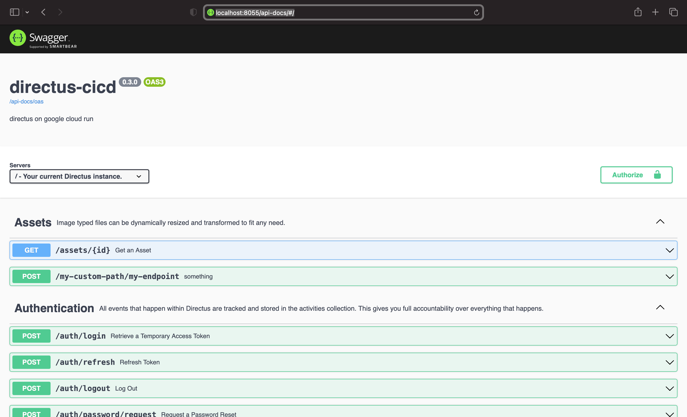

# directus-extension-api-docs

Directus Extension to include a Swagger interface and custom endpoints definitions



All directus endpoints are autogenerated on runtime.

**You can enable validations middleware based on your custom definitions. See below**

## Prerequisites

Working in a Directus nodejs project

Ref: https://github.com/directus/directus

## Installation

    npm install directus-extension-api-docs

## Configuration (optional)

For include you custom endpoints.

Create a `oasconfig.js` file under `/extensions/endpoints` folder.

Options:

-   `docsPath` _optional_ path where the interface will be (default 'api-docs')
-   `tags` _optional_ openapi custom tags
-   `paths` _optional_ openapi custom paths
-   `components` _optional_ openapi custom components (you can ref to directus standard components declaring them empty)

Example below:

```
module.exports = {
    docsPath: 'api-docs'
    tags: [
        {
            name: 'MyCustomTag',
            description: 'MyCustomTag description',
        },
    ],
    paths: {
        '/my-custom-path/my-endpoint': {
            post: {
                summary: 'do something',
                description: 'do something',
                requestBody: {
                    content: {
                        'application/json': {
                            schema: {
                                type: 'object',
                                required: ['field'],
                                properties: {
                                    field: {
                                        type: 'string',
                                    },
                                },
                            },
                        },
                    },
                    responses: {
                        '200': {
                            description: 'Successful request',
                            content: {
                                'application/json': {
                                    schema: {
                                        type: 'object',
                                        properties: {
                                            field: {
                                                type: 'string',
                                            },
                                        },
                                    },
                                },
                            },
                        },
                        '401': {
                            description: 'Unauthorized',
                            content: {},
                        },
                        '404': {
                            description: 'Not Found',
                            content: {},
                        },
                    },
                    tags: ['MyCustomTag', 'Assets'],
                },
            },
        },
    },
    components: {},
};
```

## Validations (optional)

You can enable a request validations middleware based on your custom definitions.

Call `validate` function inside your custom endpoint registration.

Pass your `router`, `services`, `schema` and a list (_optional_) of endpoints you want to validate.

Example below:

```
const { validate } = require('directus-extension-api-docs');

const id = 'my-custom-path';

module.exports = {
    id,
    handler: async function registerEndpoint(router, { services, getSchema }) {

        const schema = await getSchema();
        await validate(router, services, schema); // Enable validator for custom endpoints

        router.post('/my-endpoint', async (req, res, next) => {
            ...
        });
    },
};
```
