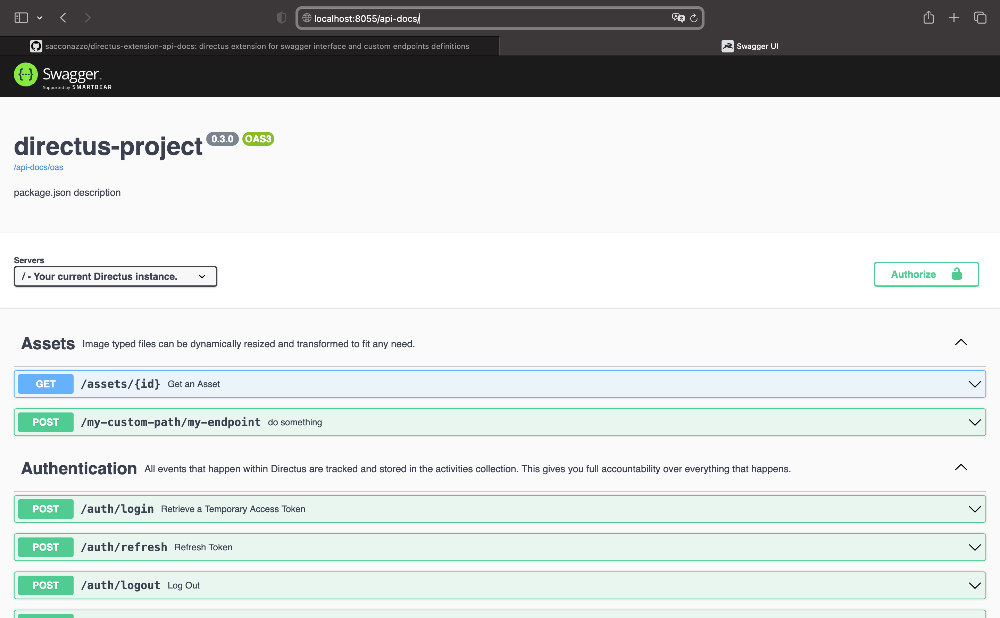

# directus-extension-api-docs

> Compatible with latest Directus versions and packaged extensions.

Directus Extension providing:

-   a Swagger UI interface (OpenAPI 3.x)
-   an autogenerated OpenAPI specification file (merged core + your custom endpoints)
    -- including custom endpoint definitions
-   optional validation middleware for your custom endpoints (based on merged OpenAPI spec). See details below



## Prerequisites

You must already have a Directus Node.js project running.

Ref: https://github.com/directus/directus

## Installation

npm install directus-extension-api-docs

-   Swagger interface: by default `http://localhost:8055/api-docs`
-   Openapi documentation: by default `http://localhost:8055/api-docs/oas`

## Configuration (optional)

To include your custom endpoints in the documentation, create an `oasconfig.yaml` file directly under the `/extensions` folder (recommended structure). Avoid placing it under `/extensions/endpoints` unless using Legacy mode.

Options:

-   `docsPath` _optional_ interface base path (default 'api-docs'). Resulting URLs: `/<docsPath>` and `/<docsPath>/oas`.
-   `info` _optional_ openapi server info (default extract from package.json)
-   `tags` _optional_ openapi custom tags (will be merged with all standard and all customs tags)
-   `publishedTags` _optional_ if specified, only operations containing at least one of these tags are kept; all other paths and unused tags are removed.
-   `paths` _optional_ custom path objects keyed by full path (e.g. `/my-custom-path/my-endpoint`). These are merged into Directus core paths.
-   `components` _optional_ custom components (schemas, securitySchemes, etc.) shallow-merged over core components.
-   `useAuthentication` _optional_ (default false). When true, `/api-docs` and `/api-docs/oas` stay publicly reachable: without valid auth they list only anonymous/public paths (no custom endpoints); with auth they list only paths permitted to that user under Directus Access Policies and custom endpoints.

Example below:

```
docsPath: 'api-docs'
useAuthentication: true
info:
  title: my-directus-bo
  version: 1.5.0
  description: my server description
tags:
- name: MyCustomTag
  description: MyCustomTag description
publishedTags:
- MyCustomTag
components:
  schemas:
    UserId:
      type: object
      required:
      - user_id
      x-collection: directus_users
      properties:
        user_id:
          description: Unique identifier for the user.
          example: 63716273-0f29-4648-8a2a-2af2948f6f78
          type: string

```

## Definitions (optional)

For each endpoint extension, you can define OpenAPI partials by adding an `oas.yaml` file in the root of that endpoint's folder.

### Non-bundled extensions

Place the `oas.yaml` file directly in the extension folder:

```
- ./extensions/
  ─ oasconfig.yaml (optional)
  - my-endpoint-extension/
    - oas.yaml
```

### Bundled extensions

For bundled extensions, place `oas.yaml` files in each sub-extension's folder under the `src` directory:

```
- ./extensions/
  ─ oasconfig.yaml (optional)
  - my-bundle-extension/
    - src/
      - routes-endpoint/
        - oas.yaml
      - admin-endpoint/
        - oas.yaml
```

This structure follows Directus's standard bundle architecture where each sub-extension (routes, endpoints, hooks, etc.) has its own folder under `src/`. The extension will automatically discover and merge all `oas.yaml` files from these subdirectories.

### Mixed environments

Both bundled and non-bundled extensions can coexist in the same project. The extension will automatically detect and merge all `oas.yaml` files from both types.

Properties:

-   `tags` _optional_ openapi custom tags
-   `paths` _optional_ openapi custom paths
-   `components` _optional_ openapi custom components

Example below (`./extensions/my-endpoint-extensions/oas.yaml`):

```
tags:
- name: MyCustomTag2
  description: MyCustomTag description2
paths:
  "/my-custom-path/my-endpoint":
    post:
      security:
        - Auth: [ ]
      summary: Validate email
      description: Validate email
      tags:
        - MyCustomTag2
        - MyCustomTag
      requestBody:
        content:
          application/json:
            schema:
              "$ref": "#/components/schemas/UserId"
      responses:
        '200':
          description: Successful request
          content:
            application/json:
              schema:
                "$ref": "#/components/schemas/Users"
        '401':
          description: Unauthorized
          content: {}
        '422':
          description: Unprocessable Entity
          content: {}
        '500':
          description: Server Error
          content: {}
components:
  schemas:
    Users:
      type: object # ref to standard components declaring it empty
  securitySchemes:
    Auth:
      in: header
      name: Authorization
      type: apiKey
```

### Legacy mode

Configuration and definitions can also be managed in this legacy structure (still supported, but prefer the simplified root placement):

```
- ./extensions/
  - endpoints/
    - oasconfig.yaml
    - my-endpoint-extensions/
      - oas.yaml
    - my-endpoint-extensions2/
      - oas.yaml
```

## Validations (optional)

You can enable a request validation middleware based on your merged custom definitions.

Call the `validate` function inside your custom endpoint source (`./extensions/my-endpoint-extensions/src/index.js`).

Arguments: `validate(router, services, schema, paths?)`. `paths` (optional array) lets you restrict validation to only specific path keys from `oasconfig.yaml` instead of all custom paths.

Example below:

```
const { validate } = require('directus-extension-api-docs')

export default {
    id: 'my-custom-path',
    handler: async (router, { services, getSchema }) => {
        const schema = await getSchema();
        await validate(router, services, schema); // Enable validator

        router.post('/my-endpoint', async (req, res, next) => {
            ...
        })
    },
}
```
